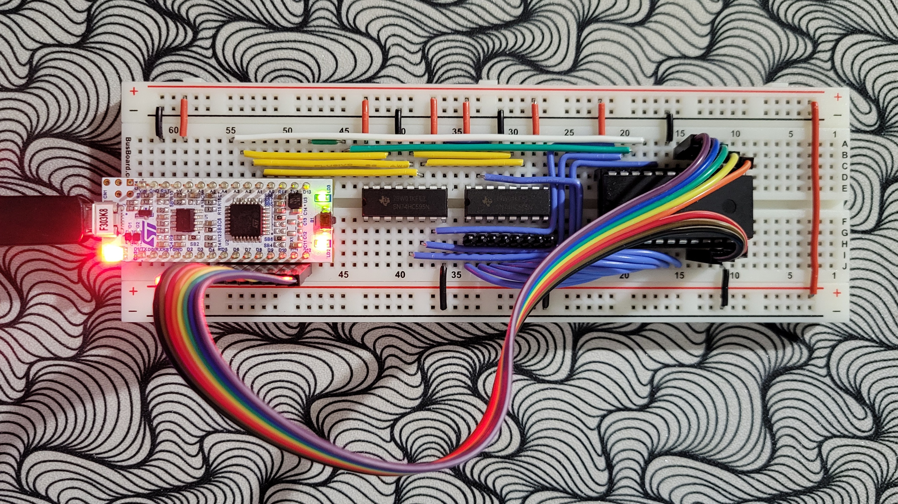
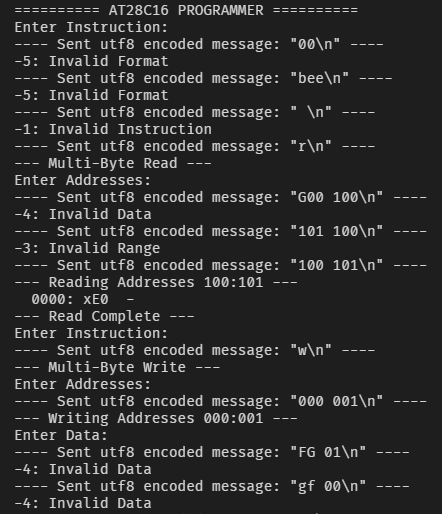
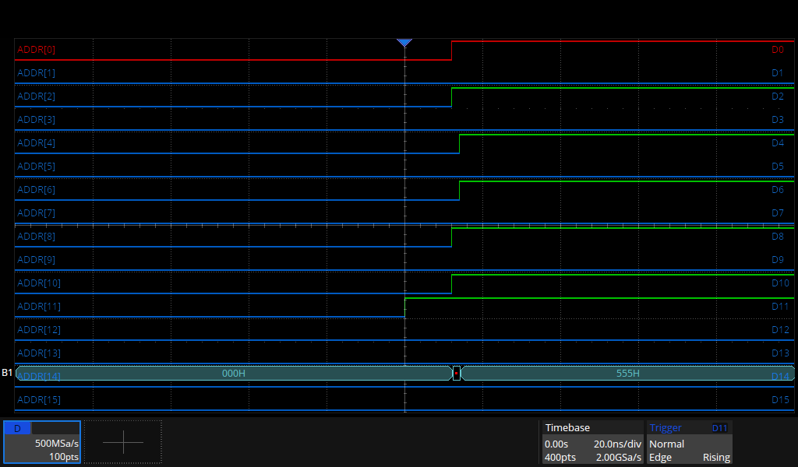
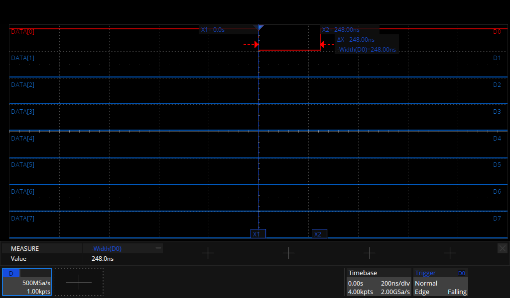
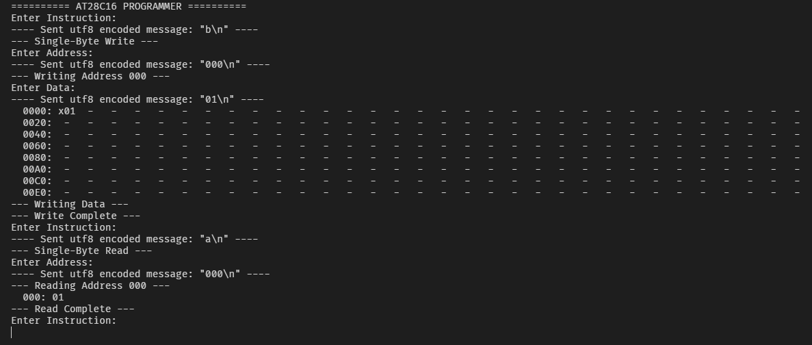
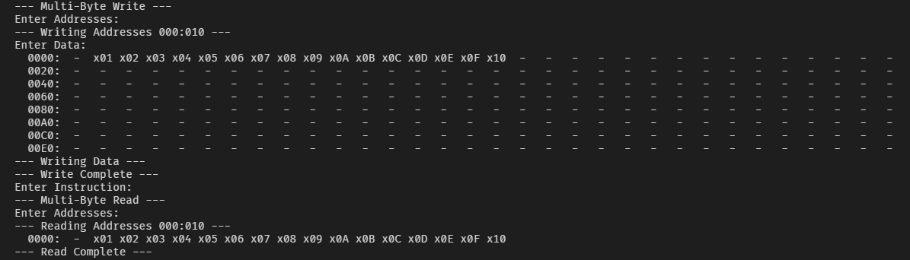
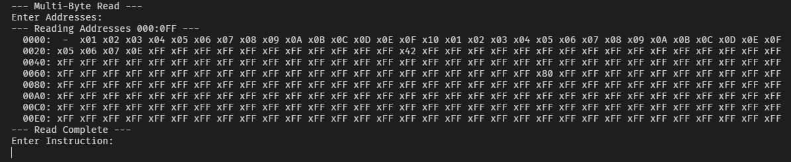

# UART-Controlled AT28C16 EEPROM Programmer
This project is a UART-controlled AT28C16 EEPROM programmer based on the STM32 NUCLEO-F303K8 microcontroller.

## Team Members and Responsibilities
As a solo project, I was solely responsible for planning, designing, parts procurement, programming, prototyping, testing, and documenting.

## Command Set
The device is controlled via commands sent through UART via the NUCLEO-F303K8's micro-USB port. These commands are used to call the functions that read and write data to the EEPROM.

|Command|Function|
|:-|:-|
|a \<address\>                | Read memory from \<address\> |
|b \<address\> \<byte\>       | Write \<byte\> to \<address\> |
|r \<start\> \<end\>          | Read memory from address \<start\> to \<end\> |
|w \<start\> \<end\> \<data\> | Write memory from address \<start\> to \<end\> with \<data\> |

> \< \> = Required

### Packet Format
* The maximum packet size is 256 data bytes + 1 packet terminator byte.
* All packets must end with the line feed (LF) character (`'\n'` or 0x0A) which serves as the packet terminator.
* All bytes (command keywords, addresses, and data) sent over UART must be one of these ASCII characters: `'0'` to `'9'`, `'a'` to `'z'`, or `'A'` to `'Z'`.
* All numbers (addresses and data bytes) must be sent in ASCII-coded hex.
* Addresses (0x000-0x7FF) must be represented using three characters, and EEPROM data (0x00-0xFF) must be represented using two characters.
* Every separate piece of data (individual addresses and individual data bytes) must be separated by spaces (`' '` or 0x20).

### Standard Operating Procedure
1. Commands must be sent as a single ASCII character corresponding to one of the commands in [Command Set](#command-set), followed by the packet terminator. This will put the device in ADDRESS mode, where it will wait to receive a valid address packet.
2. There are two address packet types: _single-address_ for commands `a` and `b` and _multi-address_ for commands `r` and `w`. A single-address packet must consist of a single-address, followed by the packet terminator. A multi-address packet must consist of a start and end address, separated by a space, then followed by the packet terminator. A valid received address packet will then put the device in DATA mode where it will wait to receive a valid data packet.
3. A valid data packet can include any number of two-character ASCII-coded hex bytes, as long as they match the address range specified in the address packet, are separated by spaces, and the packet ends with the packet terminator.
4. Upon receipt of a valid data packet, the device will perform the requested operation.

### Status Codes
Invalid packets will return one of the following status/error codes which is then translated to a string message that is sent to the user over UART.
|Code|Description|
|:-|:-|
| FA | UART_RX_EMPTY |
| FB | UART_RX_INVALID_FORMAT |
| FC | UART_RX_INVALID_DATA |
| FD | UART_RX_INVALID_RANGE |
| FE | UART_RX_INVALID_ADDRESS |
| FF | UART_RX_INVALID_INSTRUCTION |
| 00 | UART_RX_VALID_PACKET |
| 01 | UART_RX_VALID_DATA |

## Block Diagram
Block diagram of the intercommunication between the various devices required to build the EEPROM programmer.

## Circular Buffer
A large portion of this project was dedicated to developing a circular buffer API that works in conjunction with the UART Rx callback and parsing functions to buffer any received characters while the device takes time to read/write data to the EEPROM.
This was a difficult task that proved to be quite a challenge as I was not experienced in encapsulation and file scoping practices when I first started working on it.
The circular buffer uses a head and tail pointer along with a UART interrupt to independently queue and dequeue characters from a 767-byte character buffer. This size buffer allows the user to buffer up to a full packet of ASCII-coded data while the device writes the previous packet.
The circular architecture of the buffer prevents memory from being written outside of the allocated bounds of the buffer.

## EEPROM Circuit

> The AT28C16 EEPROM Programmer uses two serial shift registers for addressing and an 8-bit parallel data bus to enable full read and write of the AT28C16 EEPROM using minimal pins. These design choices allow the use of the small-footprint, breadboard-compatible NUCLEO-F303K8 microcontroller to operate the device with some pins to spare for additional functionality.

### Component List
* Micro-USB Cable (microcontroller to PC connection)
* STM32 NUCLEO-F303K8 Microcontroller
* 2 Shift Registers (SN74HC595N or equivalent)
* AT28C16 EEPROM
* 1 Breadboard or Perfboard (830+ tie-points)
* Jumper Wire and/or Ribbon Cable (21-26 AWG)

### AT28C16
The AT28C16 is a 16K-bit (2K x 8) parallel EEPROM designed for non-volatile data storage.
It operates on 5V and provides an addressable 11-bit address bus and 8-bit data bus for read and write operations.
Write operations are performed using the ~WE (Write Enable) and ~OE (Output Enable) pins according to the device's timing diagram, while the ~CE (Chip Enable) pin controls device selection.

### SN74HC595
The SN74HC595 is an 8-bit serial-in, parallel-out shift register with three-state output capabilities.
It operates on a supply voltage range of 2V to 6V.
Data is shifted into the device's storage register serially on the rising edge of the SRCLK (Shift Register Clock) and latched to the output pins on the rising edge of the RCLK (Register Clock). Outputs can be enabled or disabled using the ~OE (Output Enable) pin, allowing control over the parallel outputs.

## Test Cases
1. Instruction parser shall be robust enough to take any input, throwing errors if the instruction is formatted incorrectly.
2. Device successfully shifts the full 11-bit EEPROM address to the serial-in, parallel-out shift register.
3. Device pulses write enable pin within 100-1000 ns (from AT28C16 datasheet)
4. ‘a’ command correctly reads a single byte at the given EEPROM address
5. ‘r’ command correctly reads multiple bytes at the given block of EEPROM address
6. ‘b’ command correctly writes a single byte at the given EEPROM address
7. ‘w’ command correctly writes multiple bytes at the given block of EEPROM address

### Test Case 1

> Here, a wide range of error codes printed out to the user in different situations.

### Test Case 2

> The above logic analyzer capture of the parallel shift register demonstrates the device successfully shifting from address 0x000 to 0x555.

### Test Case 3

> The above logic analyzer capture of the Write Enable pin shows the write enable pulse width is 248ns which adequately falls between the 100-1000ns range specified by the EEPROM datasheet.

### Test Cases 4 & 5

> The command `'b'` accepts the valid address 0x000 and the valid byte 0x01, then successfully writes that byte to address 0x000, as shown by the command `'a'` which successfully printed the value 0x01 for the byte at address 0x000.

### Test Cases 6 & 7

> The command `'w'` accepts the valid addresses 0x000 to 0x010 and the valid data 0x00 to 0x10, then successfully writes the data to the correct address range, as shown by the command `'r'` which successfully printed those values for addresses 0x000 to 0x010.

> Here, the command `'r'` prints the full 256-byte packet.

## Conclusion
This UART-controlled AT28C16 EEPROM programmer demonstrates a wide range of skills I obtained in this course.
Through the pin manipulation functions, I demonstrated knowledge of the GPIO register architecture, reading and writing to the registers directly rather than relying on the HAL library.
Through the test cases, I demonstrated my ability to use a logic analyzer to capture data and signals across multiple pins, analyzing their values and timing accuracy.
Through the circular buffer library and state machine loop, I demonstrated understanding of a common data structure in UART communication using both interrupts and polling.
While there are certainly improvements to be made, listed below, this project was an overall success as the device was able to pass all 7 desired test cases consistently.

## Future Improvements
* Allow for additional data packets to be sent over UART in succession rather than a single 256-byte packet per command call.
* Clear the data packet buffer to prevent residual data from being written.
* Add additional filtering to check if the given data matches the length of the addresses given.

## References
- [AT28C16 Datasheet](https://www.microchip.com/content/dam/mchp/documents/OTH/ProductDocuments/DataSheets/doc0258.pdf)
- [SN74HC595](https://www.ti.com/lit/ds/symlink/sn74hc595.pdf)
- [Circular Buffer Example](https://embeddedartistry.com/blog/2017/05/17/creating-a-circular-buffer-in-c-and-c/)
