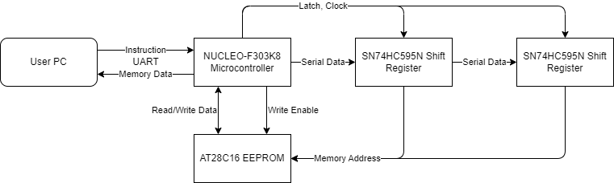

# UART-Controlled AT28C16 EEPROM Programmer
This is a UART-controlled AT28C16 EEPROM programmer based on the STM32 NUCLEO-F303K8 microcontroller.

## Parallel Read/Write Circuit
Two shift registers enable parallel read and write of the AT28C16 EEPROM using only 12 pins, thus allowing the use of the small-footprint, breadboard-compatible NUCLEO-F303K8 microcontroller.

### Component List
* STM32 NUCLEO-F303K8 Microcontroller
* Micro-USB Cable (microcontroller to PC connection)
* 2 Shift Registers (SN74HC595N or equivalent)
* 1 Breadboard or Perfboard (830+ tie-points)
* Jumper Wire and/or Ribbon Cable (21-26 AWG)

## Instruction/Command Set
The device is controlled via instructions sent through UART via the NUCLEO-F303K8's micro-USB port. These instructions will be used to call the functions that read and write data to the EEPROM.

|Instruction|Function|
|:-|:-|
|a \<address\>                | Read memory from \<address\> |
|b \<address\> \<byte\>       | Write \<byte\> to \<address\> |
|r \<start\> \<end\>          | Read memory from address \<start\> to \<end\> |
|w \<start\> \<end\> \<data\> | Write memory from address \<start\> to \<end\> with \<data\> |
|l                            | Lock EEPROM (enable write protection) |
|u                            | Unlock EEPROM (disable write protection) |

> \< \> = Required, \[ \] = Optional  \
> All values are in base hex  \
> Data can be entered with or without spaces separating each byte  \

## Block Diagram
Block diagram of the intercommunication between the various devices required to build the EEPROM programmer.

